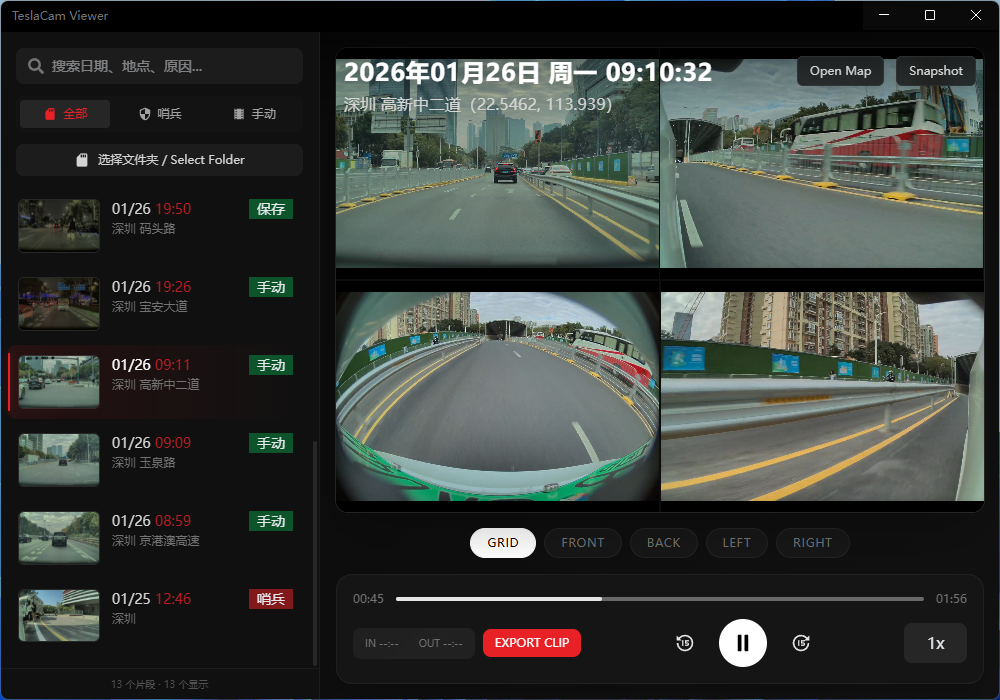

# 特斯拉行车记录仪查看器

参照车机新版操作界面，实现网格视图查看、事件点跳转、时间步进。

## 功能详解

### 📂 文件管理

- **智能分类**：自动识别剪辑类型（全部 / 哨兵 / 手动保存）。
- **深度搜索**：支持搜索日期、城市、街道或触发原因。
- **文件夹浏览**：支持直接打开 TeslaCam 根目录自动扫描。

### 📺 播放控制

- **多视图切换**：
  - **网格视图**：同时查看前后左右 4 路画面。
  - **单视图**：双击任意画面放大/缩小。
  - **快速切换**：底部按钮快速切换 Grid/Front/Back/Left/Right。
- **快捷键**：
  - `空格`：播放 / 暂停。
  - `←` / `→`：快退 / 快进 5 秒。
- **精细控制**：
  - 支持 **0.5x - 16x** 倍速播放。
  - 支持 **±15秒** 快速跳转。
  - 一键跳转到 **事件触发点**（Jump to Event）。

### 📍 位置与信息

- **地理位置**：显示事件发生的具体城市和街道名称。
- **地图联动**：点击 "Open Map" 可直接在地图中查看事发坐标。

### 💾 导出与截图

- **视频导出**：
  - 支持自定义 **入点(IN)** 和 **出点(OUT)**。
  - 自动合成当前视图（网格或单路）为视频文件。
  - 限制最大导出时长 **60秒**。
  - 格式：优先 MP4 (H.264)，不支持则回退 WebM。
- **画面截图**：
  - 点击 "Snapshot" 导出当前画面为 **JPG** 图片。

## 开发

启动本地开发服务器：

`npm run dev`

## 构建

构建 Windows 和 macOS 应用：

`npm run build`

仅构建 Windows：

`npm run build:win`

仅构建 macOS：

`npm run build:mac`

## 代码质量

格式化代码：

`npm run format`

代码检查：

`npm run lint`

## 预览

**预览地址** <https://tesla-cam.pages.dev>

