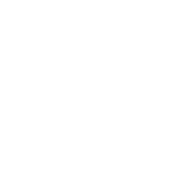

<div align="center">



# Tesla Cinema · 特斯拉行车记录仪查看器

### 把 TeslaCam U 盘变成一套能同步回放、分析险情、排查剐蹭、快速取证的本地工作台

Windows · macOS · Linux · 本地处理 · 插入 U 盘即可使用

<a href="https://github.com/Guyungy/Tesla-cam/releases/latest"></a>
&nbsp;
<a href="#-快速开始"></a>
&nbsp;
<a href="#-%E8%BD%AE%E6%AF%82%E5%89%90%E8%B9%AD%E6%8E%92%E6%9F%A5"></a>


</div>

---

<p align="center">
  
</p>

<p align="center">
  <b>六路同步回放 · SEI 行车数据 · AI 靠近轨迹 · 事件前后 10 秒快速导出</b><br>
  <sub>视频和分析均在本机完成，不上传你的行车素材</sub>
</p>

---

## 它解决什么问题

TeslaCam 会持续产生大量分段视频，但原始文件并不适合直接排查事件：

**画面是分开的** —— 前、后、左右和 B 柱需要自己逐个打开，很难对齐同一时刻。<br>
**事件不好找** —— 只知道轮毂被刮，却不知道发生在哪一天、哪一秒。<br>
**告警会漏报** —— 车辆没有触发哨兵警告，不代表画面里没有可疑接近。<br>
**取证很费事** —— 找到关键点以后，还要手工算时间、拼画面、裁视频。

Tesla Cinema 直接读取标准 `TeslaCam` 目录，把多路画面、车辆遥测和视觉检测放到同一条时间线上。你可以从整盘素材快速缩小范围，再把关键事件前后 10 秒导出成一段视频。

> 默认本地处理：视频、GPS、检测截图和模型推理都留在你的电脑上。地图按钮仅在你主动点击时打开第三方地图网站。

---

## ✨ 能做什么

| | 能力 | 说明 |
|---|---|---|
| 🎥 | **六路同步回放** | 前 / 后 / 左 / 右 / 左 B 柱 / 右 B 柱同步播放，支持六宫格、四宫格、经典布局和单画面 |
| 🔍 | **轮毂剐蹭排查** | 扫描指定车侧与多个视角，用目标检测、连续轨迹和视觉距离筛选靠近车辆的人或车 |
| 📸 | **候选证据截图** | 每个候选直接显示截图、目标框、运动轨迹、靠近方向和风险分，不用逐条盲点视频 |
| 🚘 | **行车数据仪表** | 从 H.264 SEI 读取车速、挡位、转角、油门、刹车、辅助驾驶和 GPS |
| 📊 | **行程统计** | 里程、时长、平均 / 最高车速、急刹、急打方向、挡位变化、辅助驾驶用量和驾驶评分 |
| 📍 | **轨迹与地图** | 本地 SVG 轨迹随播放头移动；中国坐标打开高德地图，其他区域打开 Google Maps |
| ✂️ | **快速取证导出** | 一键导出事件发生前 10 秒到后 10 秒，也可用 IN / OUT 自定义范围 |
| 🗂 | **大目录浏览** | 日期分组、类型筛选、搜索、真实缩略图、虚拟列表和磁盘缓存，适合整盘 U 盘素材 |

---

## 🔍 轮毂剐蹭排查

这是一个用于**缩小人工复核范围**的离线视觉分析工具。它不是只看画面有没有变化，而是分两步工作：

1. 用低频关键帧快速筛出存在持续运动的时间段；
2. 用本地 YOLOX 模型确认画面中确实有人、汽车、自行车、摩托车、公交或货车。

通过连续帧关联，候选还会显示：

- 黄色运动轨迹和绿色目标框；
- **正在靠近 / 近区停留 / 正在远离**；
- **远 / 中等 / 近 / 极近**的视觉距离等级；
- 同一录像时间段内的多视角折叠分组；
- 风险分、候选数量和对应录像秒数。

左前轮或左后轮可以单独选择，也可以组合左侧、左 B 柱、前方、后方等视角交叉确认。扫描在后台继续时，已经发现的候选可以立刻查看，不必等整盘完成。

> 距离等级来自目标框大小、位置和变化趋势，是相对视觉距离，不是经过摄像头标定的精确米数。候选只用于排查，最终是否发生接触仍需人工复核原始视频。

---

## 🚀 快速开始

### 方式一 · 下载现成应用（推荐）

前往 [**Releases**](https://github.com/Guyungy/Tesla-cam/releases/latest) 下载对应平台：

- **macOS**：`.dmg`，提供 Apple Silicon 与 Intel 版本；
- **Windows**：`.exe` 安装包；
- **Linux**：可从源码生成 `.AppImage`。

macOS 首次打开若出现安全提示，请在 Finder 中右键应用并选择「打开」。读取外接 U 盘时，系统可能会请求可移动磁盘访问权限。

<details>
<summary>方式二 · 从源码运行</summary>

需要 Node.js 20.12 或更高版本：

```bash
git clone https://github.com/Guyungy/Tesla-cam.git
cd Tesla-cam
npm install
npm run dev
```

打包安装包：

```bash
npm run build:mac    # macOS DMG
npm run build:win    # Windows NSIS
```

产物位于 `release/`。

</details>

### 插入 U 盘后怎么用

```text
1️⃣  插入 TeslaCam U 盘
2️⃣  应用自动识别固定卷名，或手动选择 TeslaCam 文件夹
3️⃣  从左侧选择录像，使用多画面同步回放
4️⃣  需要排查剐蹭时，打开「轮毂事件排查」选择位置与视角
5️⃣  找到事件后，一键导出前后 10 秒作为证据
```

标准目录结构：

```text
TeslaCam/
├── RecentClips/
├── SavedClips/
└── SentryClips/
```

当前自动加载会优先识别名为 `TESLADRIVE` 的卷；卷名不同仍可手动选择文件夹或直接拖入窗口。

---

## 🎬 回放与导出

### 多画面布局

| 布局 | 画面 |
|---|---|
| **6 GRID** | 左 / 前 / 右 + 左 B 柱 / 后 / 右 B 柱 |
| **4 GRID** | 前 / 后 / 左 / 右 |
| **4 CLASSIC** | 前摄在上，左 / 后 / 右在下 |
| **单画面** | 任意摄像头独立显示，双击可在网格与单画面之间切换 |

B 柱文件存在时才显示六宫格选项。各路视频共用播放、跳转和倍速控制。

### 视频导出

- 当前布局直接合成为 H.264 MP4；
- 快速导出事件点 **−10 秒至 +10 秒**；
- 使用 IN / OUT 标记任意裁剪范围；
- 叠加动态时间、地点、摄像头名称及真实遥测；
- 自动尝试硬件编码，失败后回退到 `libx264`；
- 合成通道最长支持 10 分钟；
- 可单独导出 JPEG 截图和完整遥测 CSV。

---

## 🚘 行车遥测

Tesla Cinema 会从视频码流里的 SEI 数据解析：

- 车速、挡位、方向盘转角；
- 油门与刹车输入；
- AP / FSD / TACC 状态；
- GPS 经纬度；
- 急刹事件与行程统计。

| 项目 | 要求 |
|---|---|
| Tesla 固件 | 通常需要 **2025.44.25+** |
| 车辆硬件 | HW3 / HW4 |
| 遥测解析 | 当前支持 H.264 SEI |
| 普通播放 | 无 SEI 的视频仍可正常播放 |

H.265 / HEVC 素材会明确显示编码提示，不会把“暂不支持解析”误报成“车辆没有数据”。

---

## ⌨️ 快捷键

| 操作 | 功能 |
|---|---|
| `Space` | 播放 / 暂停 |
| `←` / `→` | 后退 / 前进 5 秒 |
| `Shift + ←` / `Shift + →` | 后退 / 前进 1 秒 |
| `,` / `.` | 后退 / 前进一帧 |
| `↑` / `↓` | 上一个 / 下一个片段 |
| `I` / `O` | 设置导出入点 / 出点 |
| `M` | 静音 |
| `F` | 全屏 |
| `P` | 画中画 |
| 双击画面 | 网格 / 单画面切换 |
| 拖入文件夹 | 加载 TeslaCam 素材 |

播放速度支持 **0.25× – 8×**。

---

## 🔒 隐私与数据边界

| | |
|---|---|
| 🖥 **本地推理** | YOLOX / ONNX Runtime 随应用打包，识别不需要把视频上传到云端 |
| 📖 **直接读取** | 应用读取 U 盘素材；只有明确执行导出或删除时才产生写操作 |
| 🧹 **可恢复删除** | 删除片段优先移入系统废纸篓，并明确显示实际处理结果 |
| 🗺 **地图按需打开** | 只有点击地图按钮时才会把坐标交给对应地图网站 |
| 💾 **有界缓存** | 遥测和缩略图缓存设有容量上限，也可在设置中清理 |

---

## 🔬 技术实现

| 层 | 技术 |
|---|---|
| 桌面应用 | Electron 40，启用 `contextIsolation`，关闭 `nodeIntegration` |
| 界面 | React 19 · TypeScript · Tailwind CSS 4 · Vite 5 |
| 视频 | `ffmpeg-static` · `filter_complex` 多路合成 · H.264 编码 |
| 视觉检测 | YOLOX Tiny · ONNX Runtime Node |
| 遥测 | 流式 MP4 NAL 扫描 · Tesla protobuf SEI 解码 |
| 地图轨迹 | 本地 SVG 简化与播放头插值 |
| 测试 | Playwright 测试套件 · ESLint · TypeScript |

视觉扫描采用关键帧预筛、曝光补偿、全局运动抑制和多帧目标一致性检查，减少路灯变化、整车移动和空道路造成的误报。候选缩略图按需提取，扫描结果写入版本化磁盘缓存，重新打开相同素材时无需重复计算。

<details>
<summary><b>项目结构</b></summary>

```text
Tesla-cam/
├── electron/
│   ├── main.ts               Electron 主进程与 IPC
│   ├── visionDetector.ts     YOLOX ONNX 目标检测
│   ├── visionScan.ts         运动预筛、轨迹与风险排序
│   └── visionTypes.ts        视觉扫描共享类型
├── src/
│   ├── app/                  应用入口与素材管理
│   ├── components/
│   │   ├── Viewer.tsx        多路播放与导出入口
│   │   ├── WheelScan.tsx     轮毂事件排查界面
│   │   └── viewer/           播放、遥测和导出 hooks
│   └── utils/                TeslaCam、SEI、统计与布局工具
├── tests/                    单元与真实素材测试
├── build/models/             随应用分发的视觉模型
└── public/                   图标与 README 截图
```

</details>

---

## 🧪 开发与测试

```bash
npm install
npm run dev

npm run lint
npx tsc -b
npx tsc -p tsconfig.electron.json
npm test
```

依赖真实 TeslaCam 素材的测试在没有接入素材时会自动跳过。CI 配置见 [`.github/workflows/ci.yml`](.github/workflows/ci.yml)。

---

## ⚠️ 已知限制

- 视觉分析是候选筛选，不是碰撞责任认定；光照、遮挡、镜头污渍和目标过小仍可能影响结果。
- 当前距离仅为“远 / 中等 / 近 / 极近”的视觉等级；要输出米数，需要对具体车型和摄像头做标定。
- H.265 / HEVC 视频可播放，但当前 SEI 遥测解析器以 H.264 为主。
- 车辆没有写入 SEI 时，行车仪表、GPS 和统计会保持空白，原始视频仍可查看与导出。
- 长时间扫描的速度取决于 U 盘读取速度、视频数量和所选摄像头数量。

---

## 🤝 参与贡献

欢迎提交 Issue 或 Pull Request。反馈问题时，建议附上：

- 操作系统与芯片架构；
- Tesla 车型、固件版本及视频编码；
- 问题出现在哪个视角和时间段；
- 可公开的错误日志或脱敏截图。

请勿上传含车牌、人脸、家庭住址或精确行车轨迹的原始素材。

---

## ⭐

如果它帮你少翻了几小时视频，或者找到了原本被哨兵漏掉的关键画面，欢迎点一个 Star。

<div align="center">

**[GPL-3.0](LICENSE)** · 仅用于处理你有权查看的行车记录

</div>
