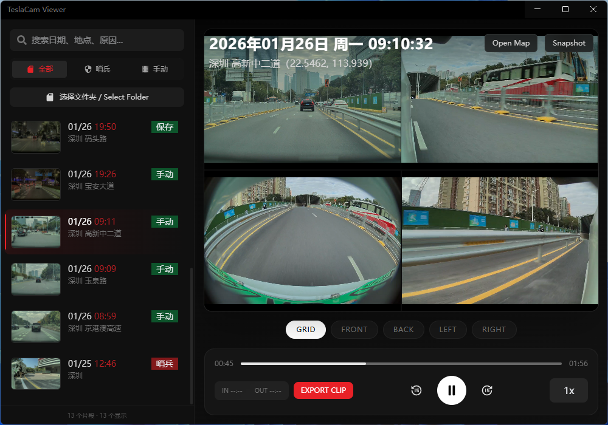

# Tesla Cinema — TeslaCam Viewer

A modern desktop app for viewing Tesla Dashcam footage with synchronized multi-camera playback, real-time driving telemetry, and H.264 video export.



## Download

**No development environment needed.** Download the installer for your platform from [GitHub Releases](https://github.com/Guyungy/Tesla-cam/releases):

- **Windows**: `.exe` installer
- **macOS**: `.dmg` (Intel & Apple Silicon)

---

## Features

### Multi-Camera Synchronized Playback

Perfect frame-level sync across all cameras with multiple viewing modes:

| Layout | Description |
|--------|-------------|
| **6 Grid** | All 6 cameras in 3×2 grid (including B-pillar) |
| **4 Grid** | Front / Back / Left / Right in 2×2 grid |
| **4 Classic** | Front camera top (60%), three cameras bottom |
| **Single** | Any camera fullscreen — double-click to toggle |

Each grid cell shows a camera label (Front / Back / Left / Right / L-Pillar / R-Pillar) for quick identification.

### B-Pillar Camera Support

Full coverage including Tesla's interior B-pillar cameras (`left_pillar` / `right_pillar`). Automatically detected — 6-grid layout appears only when B-pillar files are present.

### Real-Time Driving Dashboard

Auto-parses SEI metadata embedded in Tesla dashcam H.264 streams and displays a live telemetry overlay:

- **Speed** — large gauge with color coding (green / yellow / red)
- **Gear** — P / R / N / D highlight
- **Steering angle** — SVG arc indicator with degree readout
- **Pedals** — throttle (green bar) and brake (red bar)
- **Autopilot status** — OFF / AP / FSD / TACC badge
- **GPS coordinates** — latitude / longitude

> **Note:** Vehicle metadata is only available in videos recorded with Tesla firmware **2025.44.25** or later on HW3+. SEI data may not be present while parked.

### Speed Curve in Progress Bar

Hover over the timeline to see a speed-over-time sparkline rendered in the progress bar background. Instantly spot hard acceleration, braking, and cruising segments.

### Smart Filtering & Date Grouping

- Filter by type: **All / Sentry / Saved**
- Search by date, location, or event reason
- Clips grouped by date: **Today / Yesterday / 2025-04-03...**
- Event reason displayed on clip cards (e.g., "object detected")

### H.264 Video Export

Export the current view (any layout) as an H.264 MP4 video powered by FFmpeg:

- Set **IN / OUT** points for precise clip trimming (visible as blue range on timeline)
- Adaptive overlay with timestamp and location (font scales to resolution)
- All multi-grid layouts export at **1920×1080** (1080p)
- Export modal shows frame count and estimated remaining time
- One-click screenshot export (JPEG)

### Driving Data CSV Export

Export complete driving telemetry to CSV for further analysis:

```
offset_s, speed_kph, gear, steering_deg, brake_pct, throttle_pct, ap_status, latitude, longitude
```

### Map Integration

- **Auto-detect region**: China coordinates → Amap (高德地图), otherwise → Google Maps
- Both map links shown simultaneously in the header
- Click to open exact event location

### Interactive Controls

| Control | Action |
|---------|--------|
| `Space` | Play / Pause |
| `← →` | Seek ±5 seconds |
| `F` | Toggle fullscreen |
| `P` | Picture-in-Picture |
| `M` | Mute / Unmute |
| `I` / `O` | Set IN / OUT export points |
| Double-click | Toggle single / grid view |
| Drag & Drop | Drop a TeslaCam folder onto the window to load |

Playback speed: **0.25x – 8x**

### Bilingual UI (中文 / English)

Full Chinese and English support. Language auto-detected from browser settings, switchable via Settings (gear icon in title bar). Timestamps, labels, and all UI text follow the selected language.

---

## Development

### Prerequisites

- Node.js >= 20.12
- npm

### Setup

```bash
npm install
```

### Dev Server

```bash
npm run dev
```

### Build

```bash
# Windows
npm run build:win

# macOS
npm run build:mac
```

Output goes to the `release/` directory.

### Tech Stack

- **Electron 40** — desktop shell
- **React 19** + **TypeScript 5.8**
- **Tailwind CSS 4** — styling
- **Vite 5** — build tool
- **FFmpeg** (bundled via ffmpeg-static) — H.264 video encoding
- **Custom SEI parser** — Tesla protobuf metadata decoding (zero dependencies)

### Optional Python tools

The `tesla_cinema/` package and `sei_extractor.py` are **optional helpers** (SEI experiments / an alternate PySide6 viewer). The product app is Electron:

```powershell
python -m pip install -e .
python -m tesla_cinema   # Qt viewer (experimental)
```

---

## License

MIT
